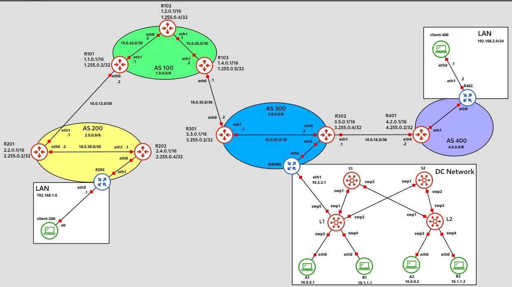
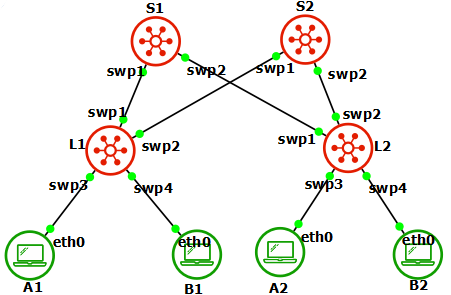

# Progetto 1

# Topologia


## BGP
Per quanto riguarda gli AS configuriamo i vari nodi per scambiarsi messaggi con BGP.
> Aggiungere a ciascun file `start.sh` la riga di codice `vtysh < /etc/frr/progetto_NSD.sh`
Creare poi il file `/etc/frr/progetto_NSD.sh` in ciascun nodo con i seguenti comandi.

### AS 100
Iniziamo a configurare l'AS 100.

Prima di tutto configuriamo MPLS, OSPF, BGP.
Creiamo quindi questi file che chiamiamo `/etc/frr/progetto_NSD.sh` che verranno eseguiti come `vtysh < /etc/frr/progetto_NSD.sh` per configurare tutto.

- R101:
    ```bash
    conf t
    interface lo
    ip address 1.1.0.1/16
    ip address 1.255.0.2/32

    interface eth0
    ip address 10.0.12.2/30
    interface eth1
    ip address 10.0.24.1/30

    router ospf
    router-id 1.255.0.2
    network 1.1.0.0/16 area 0
    network 1.255.0.2/32 area 0
    network 10.0.24.0/30 area 0
    exit

    mpls ldp
    router-id 1.255.0.2
    ordered-control
    address-family ipv4
    discovery transport-address 1.255.0.2
    interface eth1
    interface lo
    exit

    router bgp 100
    network 1.1.0.0/16

    neighbor 1.255.0.5 remote-as 100
    neighbor 1.255.0.5 update-source 1.255.0.2
    neighbor 10.0.12.1 remote-as 200

    address-family ipv4
    neighbor 1.255.0.5 activate
    neighbor 1.255.0.5 next-hop-self
    redistribute static
    exit

    end
    ```

- R102:
    ```bash
    conf t
    interface lo
    ip address 1.2.0.1/16
    ip address 1.255.0.4/32
    interface eth0
    ip address 10.0.24.2/30
    interface eth1
    ip address 10.0.45.1/30

    router ospf
    router-id 1.255.0.4

    network 1.2.0.0/16 area 0
    network 1.255.0.4/32 area 0
    network 10.0.24.0/30 area 0
    network 10.0.45.0/30 area 0
    exit

    mpls ldp
    router-id 1.255.0.4
    ordered-control
    address-family ipv4
    discovery transport-address 1.255.0.4
    interface eth0
    interface eth1
    interface lo

    end
    ```

- R103:
    ```bash
    conf t
    interface lo
    ip address 1.4.0.1/16
    ip address 1.255.0.5/32

    interface eth0
    ip address 10.0.35.1/30

    interface eth1
    ip address 10.0.45.2/30

    router ospf
    router-id 1.255.0.5

    network 1.4.0.0/16 area 0
    network 1.255.0.5/32 area 0
    network 10.0.45.0/30 area 0
    exit

    mpls ldp
    router-id 1.255.0.5
    ordered-control
    address-family ipv4
    discovery transport-address 1.255.0.5
    interface eth1
    interface lo
    exit

    router bgp 100
    network 1.4.0.0/16

    neighbor 1.255.0.2 remote-as 100
    neighbor 1.255.0.2 update-source 1.255.0.5
    neighbor 10.0.35.2 remote-as 300

    address-family ipv4
    neighbor 1.255.0.2 activate
    redistribute static
    neighbor 1.255.0.2 next-hop-self
    exit

    end
    ```
Una volta fatto questo bisogna configurare l'input di MPLS sulle interfacce di ciascun router.
Creiamo il file `/etc/frr/sysctl.conf` in modo che ad ogni riavvio questo non venga eliminato, con i seguenti contenuti.

- R101:
    ```bash
    net.mpls.conf.lo.input = 1
    net.mpls.conf.eth1.input = 1
    net.mpls.platform_labels = 100000
    ```

- R102:
    ```bash
    net.mpls.conf.lo.input = 1
    net.mpls.conf.eth0.input = 1
    net.mpls.conf.eth1.input = 1
    net.mpls.platform_labels = 100000
    ```

- R103:
    ```bash
    net.mpls.conf.lo.input = 1
    net.mpls.conf.eth1.input = 1
    net.mpls.platform_labels = 100000
    ```

Ad ogni avvio per rendere queste configurazioni attive bisognerà invocare i seguenti comandi:
```bash
cp /etc/frr/sysctl.conf /etc/sysctl.conf
sysctl -p
```

### AS 200
In questo caso bisogna configurare solo BGP per il routing esterno e OSPF per quello interno.
Creiamo i file come mostrato prima.

- R201:
    ```bash
    conf t
    interface lo
    ip address 2.2.0.1/16
    ip address 2.255.0.2/32

    interface eth0
    ip address 10.0.20.2/30
    interface eth1
    ip address 10.0.12.1/30

    router ospf
    router-id 2.255.0.2

    network 2.2.0.0/16 area 0
    network 2.255.0.2/32 area 0
    network 10.0.20.0/30 area 0

    router bgp 200
    network 2.2.0.0/16
    neighbor 2.255.0.4 remote-as 200
    neighbor 2.255.0.4 update-source 2.255.0.2
    neighbor 2.255.0.4 next-hop-self

    neighbor 10.0.12.2 remote-as 100
    end
    ```
- R202
    ```bash
    conf t
    interface lo
    ip address 2.4.0.1/16
    ip address 2.255.0.4/32

    interface eth1
    ip address 10.0.20.1/30

    interface eth0
    ip address 2.4.10.1/24

    router ospf
    router-id 2.255.0.4

    network 2.4.0.0/16 area 0
    network 2.255.0.4/32 area 0
    network 10.0.20.0/30 area 0

    router bgp 200
    network 2.4.0.0/16
    neighbor 2.255.0.2 remote-as 200
    neighbor 2.255.0.2 update-source 2.255.0.4
    neighbor 2.255.0.2 next-hop-self

    end
    exit
    ```

- R203
    ```bash
    ip a a 192.168.1.1/24 dev eth0
    ip a a 2.4.10.10/24 dev eth1

    iptables -t nat -F
    echo 1 > /proc/sys/net/ipv4/ip_forward

    export LAN=eth0
    export WAN=eth1

    iptables -F
    iptables -P FORWARD DROP
    iptables -P INPUT DROP
    iptables -P OUTPUT ACCEPT

    iptables -A FORWARD -m state --state ESTABLISHED -j ACCEPT
    iptables -A FORWARD -i $LAN -p tcp --dport 80 -j ACCEPT
    iptables -A FORWARD -i $LAN -p tcp --dport 443 -j ACCEPT
    iptables -A FORWARD -i $LAN -p tcp --dport 22 -j ACCEPT
    iptables -A FORWARD -i $LAN -p udp --dport 53 -j ACCEPT
    iptables -A INPUT -m state --state ESTABLISHED -j ACCEPT
    iptables -A INPUT -i $LAN -p tcp --dport 22 -j ACCEPT
    iptables -A INPUT -i $WAN -p tcp --dport 22 -j ACCEPT
    iptables -A INPUT -p icmp -j ACCEPT
    iptables -A FORWARD -p icmp -j ACCEPT

    iptables -t nat -A POSTROUTING -o eth1 -j MASQUERADE

    ip route add default via 2.4.10.1
    ```

- client-200:

    ```bash
    ip a a 192.168.1.2/24 dev enp0s8
    sudo ip add route default via 192.168.1.1
    ```

    - AppArmor (client-200):\
    Creare il file `/etc/apparmor.d/usr.bin.ping`
    
        ```bash
        # Last Modified: Tue Mar 12 18:18:43 2024
        include <tunables/global>

        # File: /etc/apparmor.d/usr.bin.ping


        /usr/bin/ping {
            include <abstractions/base>
            
            capability setgid,
            capability setuid,
            
            deny network,
            
            /bin/ping ix,
            /bin/ping6 ix,
            /etc/host.conf r,
            /etc/hosts r,
            /etc/ld.so.cache r,
            /etc/nsswitch.conf r,
            /etc/resolv.conf r,

        }
        ```

        Per `impostare` il profilo AppArmor in modalità enforcement:
        ```bash
        sudo aa-enforce /etc/apparmor.d/usr.bin.ping 
        ```


        Per `aggiornare` il profilo AppArmor dopo averlo `modificato`:
        ```bash
        sudo apparmor_parser -r /etc/apparmor.d/usr.bin.ping 
        ``` 

        Per `aggiornare` tutti i `profili` includendo quello appena creato:
        ```bash
        sudo aa-logprof
        ```

        Per `disabilitare` il profilo:
        ```bash
        sudo aa-disable /etc/apparmor.d/usr.bin.ping
        ```

### AS 300
- R301:
    ```bash
    conf t
    interface lo
    ip address 3.3.0.1/16
    ip address 3.255.0.2/32

    interface eth0
    ip address 10.0.35.2/30
    interface eth1
    ip address 10.0.65.1/30

    router ospf
    router-id 3.255.0.2

    network 3.3.0.0/16 area 0
    network 3.255.0.2/32 area 0
    network 10.0.65.0/30 area 0
    exit

    router bgp 300
    network 3.3.0.0/16
    neighbor 3.255.0.4 remote-as 300
    neighbor 3.255.0.4 update-source 3.255.0.2
    neighbor 3.255.0.4 next-hop-self

    neighbor 10.0.35.1 remote-as 100
    end
    ```

- R302:
    ```bash
    conf t
    interface lo
    ip address 3.5.0.1/16
    ip address 3.255.0.4/32

    interface eth0
    ip address 10.0.65.2/30
    interface eth1
    ip address 10.0.16.1/30
    interface eth2
    ip address 3.5.10.1/24

    router ospf
    router-id 3.255.0.4

    network 3.5.0.0/16 area 0
    network 3.255.0.4/32 area 0
    network 10.0.65.0/30 area 0

    router bgp 300
    network 3.5.0.0/16
    neighbor 3.255.0.2 remote-as 300
    neighbor 3.255.0.2 update-source 3.255.0.4
    neighbor 3.255.0.2 next-hop-self

    neighbor 10.0.16.2 remote-as 400
    end

    show ip route
    show ip bgp
    ```
    
- GW300
    ```bash
    ip a a 3.5.10.10/24 dev eth0
    ip addr add 10.3.3.1/24 dev eth1

    iptables -t nat -F
    echo 1 > /proc/sys/net/ipv4/ip_forward
    iptables -t nat -A POSTROUTING -o eth0 -j MASQUERADE

    ip route add default via 3.5.10.1

    ip route add 10.0.0.0/24 via 10.3.3.254 dev eth1
    ip route add 10.1.1.0/24 via 10.3.3.254 dev eth1
    ```

#### DC Network


Per creare la DC Network si è utilizzato il modello spine-leaf.

Una volta creati i nodi spines e i leaves con cumulus Linux (è stato utilizzato Cumulus Linux 4.1), questi sono stati configurati nel seguente modo:

- S1:
    ```bash
    net del all

    net add interface swp1 ip add 10.1.1.2/30
    net add interface swp2 ip add 10.2.1.2/30
    net add loopback lo ip add 4.4.4.4/32

    net add ospf router-id 4.4.4.4
    net add ospf network 0.0.0.0/0 area 0

    net add bgp autonomous-system 65000
    net add bgp router-id 4.4.4.4
    net add bgp neighbor swp1 remote-as external
    net add bgp neighbor swp2 remote-as external

    net add bgp evpn neighbor swp1 activate
    net add bgp evpn neighbor swp2 activate

    net commit
    ```

- S2:
    ```bash
    net del all

    net add interface swp1 ip add 10.1.2.2/30
    net add interface swp2 ip add 10.2.2.2/30
    net add loopback lo ip add 5.5.5.5/32

    net add ospf router-id 5.5.5.5
    net add ospf network 0.0.0.0/0 area 0

    net add bgp autonomous-system 65000
    net add bgp router-id 5.5.5.5
    net add bgp neighbor swp1 remote-as external
    net add bgp neighbor swp2 remote-as external

    net add bgp evpn neighbor swp1 activate
    net add bgp evpn neighbor swp2 activate

    net commit
    ```

- L1:
    ```bash
    net del all
    net commit

    net add bridge bridge ports swp3,swp4,swp5
    net add interface swp3 bridge access 10
    net add interface swp4 bridge access 20
    net add interface swp5 bridge access 30
    net commit

    net add interface swp1 ip add 10.1.1.1/30
    net add interface swp2 ip add 10.1.2.1/30
    net add loopback lo ip add 1.1.1.1/32
    net commit

    net add ospf router-id 1.1.1.1
    net add ospf network 10.1.1.0/30 area 0
    net add ospf network 10.1.2.0/30 area 0
    net add ospf network 1.1.1.1/32 area 0
    net add ospf passive-interface swp3,swp4,swp5
    net commit

    net add vxlan vni100 vxlan id 100
    net add vxlan vni100 vxlan local-tunnelip 1.1.1.1
    net add vxlan vni100 bridge access 10

    net add vxlan vni200 vxlan id 200
    net add vxlan vni200 vxlan local-tunnelip 1.1.1.1
    net add vxlan vni200 bridge access 20

    net add vxlan vni300 vxlan id 300
    net add vxlan vni300 vxlan local-tunnelip 1.1.1.1
    net add vxlan vni300 bridge access 30

    net add bgp autonomous-system 65001
    net add bgp router-id 1.1.1.1

    net add bgp neighbor swp1 remote-as 65000
    net add bgp neighbor swp2 remote-as 65000

    net add bgp evpn neighbor swp1 activate
    net add bgp evpn neighbor swp2 activate
    net add bgp evpn advertise-default-gw
    net add bgp evpn advertise-all-vni

    net commit

    net add vlan 10 ip address 10.0.0.254/24
    net add vlan 20 ip address 10.1.1.254/24
    net add vlan 30 ip address 10.3.3.254/24
    net commit

    net add vlan 50
    net add vxlan vni-1020 vxlan id 1020
    net add vxlan vni-1020 vxlan local-tunnelip 1.1.1.1
    net add vxlan vni-1020 bridge access 50
    net commit

    net add vrf TEN1 vni 1020
    net add vlan 50 vrf TEN1
    net add vlan 10 vrf TEN1
    net add vlan 20 vrf TEN1
    net add vlan 30 vrf TEN1

    net add vlan 50 ip gateway 10.3.3.1

    net commit
    ```

- L2:
    ```bash
    net del all
    net commit

    net add bridge bridge ports swp3, swp4
    net add interface swp3 bridge access 10
    net add interface swp4 bridge access 20

    net add interface swp1 ip add 10.2.1.1/30
    net add interface swp2 ip add 10.2.2.1/30
    net add loopback lo ip add 2.2.2.2/32

    net add ospf router-id 2.2.2.2
    net add ospf network 10.2.1.0/30 area 0
    net add ospf network 10.2.2.0/30 area 0
    net add ospf network 2.2.2.2/32 area 0
    net add ospf passive-interface swp3,swp4

    net add vxlan vni100 vxlan id 100
    net add vxlan vni100 vxlan local-tunnelip 2.2.2.2
    net add vxlan vni100 bridge access 10

    net add vxlan vni200 vxlan id 200
    net add vxlan vni200 vxlan local-tunnelip 2.2.2.2
    net add vxlan vni200 bridge access 20

    net add bgp autonomous-system 65002
    net add bgp router-id 2.2.2.2

    net add bgp neighbor swp1 remote-as 65000
    net add bgp neighbor swp2 remote-as 65000

    net add bgp evpn neighbor swp1 activate
    net add bgp evpn neighbor swp2 activate
    net add bgp evpn advertise-all-vni

    net commit

    net add vlan 10 ip address 10.0.0.254/24
    net add vlan 20 ip address 10.1.1.254/24
    net commit

    net add vlan 50
    net add vxlan vni-1020 vxlan id 1020
    net add vxlan vni-1020 vxlan local-tunnelip 2.2.2.2
    net add vxlan vni-1020 bridge access 50
    net commit

    net add vrf TEN1 vni 1020
    net add vlan 50 vrf TEN1
    net add vlan 10 vrf TEN1
    net add vlan 20 vrf TEN1
    net commit
    ```

I nodi client sotto ogni leaf sono stati configurati nel seguente modo:
- A1:
    ```bash
    ip addr add 10.0.0.1/24 dev eth0
    ip route add default via 10.0.0.254
    ```

- A2:
    ```bash
    ip addr add 10.0.0.2/24 dev eth0
    ip route add default via 10.0.0.254
    ```

- B1:
    ```bash
    ip addr add 10.1.1.1/24 dev eth0
    ip route add default via 10.1.1.254
    ```

- B2:
    ```bash
    ip addr add 10.1.1.2/24 dev eth0
    ip route add default via 10.1.1.254
    ```

### AS 400
- R401:
    ```bash
    conf t
    interface lo
    ip address 4.2.0.1/16

    interface eth0
    ip address 10.0.16.2/30

    interface eth1
    ip address 4.2.10.1/24

    router bgp 400
    network 4.2.0.1/16

    neighbor 10.0.16.1 remote-as 300
    end
    ```

- R402:
    ```bash
    ip a a 192.168.2.2/24 dev eth1
    ip a a 4.2.10.10/24 dev eth0

    iptables -t nat -F
    echo 1 > /proc/sys/net/ipv4/ip_forward
    iptables -t nat -A POSTROUTING -o eth0 -j MASQUERADE

    ip route add default via 4.2.10.1
    ```

- client-400:
    ```bash
    ip a a 192.168.2.1/24 dev eth0
    ip route add default via 192.168.2.2
    ```

Una volta eseguiti questi comandi si può testare se funziona facendo il ping tra un nodo di un qualsiasi AS e un nodo di un altro AS.
Per fare questo `ping <indirizzo_IP primo nodo> -I <indirizzo_IP secondo nodo>`.
Inoltre, si può controllare il contenuto delle tabelle bgp eseguendo ad esempio il comando `show ip bgp summary` in `vtysh`.

## OVPN
Partiamo dal GW300 che fungerà da server per la VPN.
Da questo generiamo le chiavi per la comunicazione da condividere con i client e impostiamo le rotte appartenti alla VPN stessa.

Per fare questo eseguiamo il file `openVPN.sh`.

- GW300:

    File `openVPN.sh`:
    ```bash
    #generiamo i certificati per OVPN
    cd /usr/share/easy-rsa
    ./easyrsa init-pki
    ./easyrsa build-ca nopass

    ./easyrsa build-server-full GW300 nopass
    ./easyrsa build-client-full client-200 nopass
    ./easyrsa build-client-full R402 nopass

    #generazione parametri DH
    ./easyrsa gen-dh

    mkdir /root/CA
    mkdir /root/CA/GW300
    mkdir /root/CA/client-200
    mkdir /root/CA/R402 
    #ca crt deve essere conosciuto da tutti
    cp /usr/share/easy-rsa/pki/ca.crt /root/CA/ #server deve avere suo certificato
    cp /usr/share/easy-rsa/pki/issued/GW300.crt /root/CA/server/
    cp /usr/share/easy-rsa/pki/private/GW300.key /root/CA/server/
    cp /usr/share/easy-rsa/pki/dh.pem /root/CA/server/
    cp /usr/share/easy-rsa/pki/issued/client-200.crt /root/CA/client1/
    cp /usr/share/easy-rsa/pki/private/client-200.key /root/CA/client1/
    cp /usr/share/easy-rsa/pki/issued/R402.crt /root/CA/client2/
    cp /usr/share/easy-rsa/pki/private/R402.key /root/CA/client2/
    #adesso andiamo nella directory CA per copiare il materiale necessario sui client
    cd /root/CA/
    #da qui copiamo certificato ca
    cat ca.crt 
    #basta copiare da begin a end certificate
    cat client1/client-200.crt
    cat client1/client-200.key
    #basta copiare da begin a end certificate
    cat client2/R402.crt 
    cat client2/R402.key
    ```

    Una volta eseguito questo file copiare certificati e chiavi sui client della VPN.

    Abbiamo poi il file di configurazione `GW300.ovpn` per impostare in automatico le rotte sui client e avviare la comunicazione tramite VPN:
    ```bash
    port 1194
    proto udp
    dev tun
    ca ca.crt
    cert GW300.crt
    key GW300.key
    dh dh.pem
    server 192.168.100.0 255.255.255.0

    push "route 192.168.1.0 255.255.255.0"
    push "route 192.168.2.0 255.255.255.0"
    push "route 10.0.0.0 255.255.255.0"
    push "route 10.1.1.0 255.255.255.0"

    route 192.168.1.0 255.255.255.0
    route 192.168.2.0 255.255.255.0

    client-config-dir ccd
    client-to-client
    keepalive 10 120
    cipher AES-256-GCM
    ```

    Nella cartella `/CA/server/ccd` inseriamo due file per gli `iroute` in modo raggiungere client esterni alla VPN con la VPN stessa.

    -   GW300:
    ```bash
    iroute 10.0.0.0 255.255.255.0
    iroute 10.1.1.0 255.255.255.0
    ```

    - R402:
    ```bash
    iroute 192.168.2.0 255.255.255.0
    ```

- R402:
    ```bash
    client
    dev tun
    proto udp
    remote 3.5.10.10 1194
    resolv-retry infinite
    ca ca.crt
    cert R402.crt
    key R402.key
    remote-cert-tls server
    cipher AES-256-GCM
    ```

- client-200:
    ```bash
    client
    dev tun
    proto udp
    remote 3.5.10.10 1194
    resolv-retry infinite
    ca ca.crt
    cert client-200.crt
    key client-200.key
    remote-cert-tls server
    cipher AES-256-GCM
    ```
